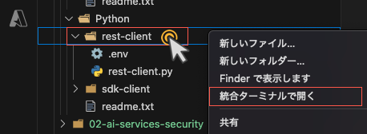
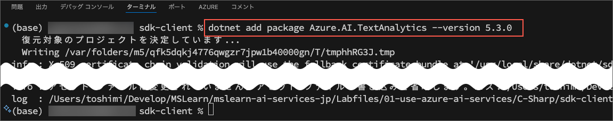

---
lab:
    title: 'Azure AI Service のはじめ方'
    module: 'Module 2 - Azure AI サービスの使用を開始する'
---

# Azure AI Service のはじめ方

この演習では、Azure AI Service を使うために、自分の Azure サブスクリプションで **Azure AI Service** のリソースを作成し、それをクライアントアプリケーションから使います。この演習の目的は、特定のサービスについて詳しくなることではなく、開発者として Azure AI サービスを準備して使う一般的な方法に慣れることです。

## Visual Studio Code にリポジトリをクローンする

Visual Studio Code を使ってコードを開発します。アプリ用のコードファイルは GitHub リポジトリに用意されています。


> **ヒント**: すでに **mslearn-ai-services-jp** リポジトリをクローンしている場合は、それを Visual Studio Code で開いてください。まだの場合は、以下の手順に従って開発環境にクローンしてください。

1. Visual Studio Code を起動します。
2. コマンドパレットを開き（SHIFT + CTRL + P）、**Git: Clone** コマンドを実行して、`https://github.com/mocaomochi/mslearn-ai-services.ja-jp` リポジトリをローカルフォルダにクローンします（フォルダの場所はどこでも構いません）。
3. リポジトリがクローンされたら、そのフォルダを Visual Studio Code で開きます。
4. 必要に応じて、リポジトリ内の C# プロジェクトをサポートするための追加ファイルがインストールされるのを待ちます。
> 注意: 必要なアセットを追加してビルドやデバッグを行うよう求められた場合は、Not Now（今はしない） を選択してください。
5. Labfiles/01-use-azure-ai-services フォルダを展開します。


C# と Python のコードが用意されています。自分が使いたい言語のフォルダを展開してください。

## Azure AI Services リソースを作成する

Azure AI Service は、アプリケーションに組み込むことができる人工知能機能を提供するクラウドベースのサービスです。特定の API（例えば、**Language** や **Vision**）用に個別の Azure AI Services リソースを作成することもできますし、複数の Azure AI Services API に単一のエンドポイントとキーを通じてアクセスできる **Azure AI Services** リソースを 1 つ作成することもできます。今回は、単一の **Azure AI Services** リソースを使用します。

1. `https://portal.azure.com` で Azure ポータルを開き、Azure サブスクリプションに関連付けられた Microsoft アカウントでサインインします。
2. 上部の検索バーで *Azure AI services* と入力して検索し、**Azure AI Services** を選択して、以下の設定で Azure AI Service マルチサービスアカウントリソースを作成します。

    

    > 注意: Azure には、Azure AI Serives という名前のリソースが複数種類あります。 Azure AI Services Multi Service Account は以下のスクリーンショットのアイコンのAzure AI Servicesを選択してください。

    

    - **サブスクリプション**: *自分の Azure サブスクリプション*
    - **リソースグループ**: *既存のリソースグループを選択するか新しいものを作成（制限付きのサブスクリプションを使用している場合、新しいリソースグループを作成する権限がない場合があります。その場合は提供されたものを使用してください）*
    - **Region**: *利用可能なリージョンを選択*
    - **Name**: *一意の名前を入力*
    - **Pricing tier**: Standard S0


3. 必要なチェックボックスを選択してリソースを作成します。
4. デプロイが完了するのを待ち、デプロイの詳細を確認します。
5. リソースに移動し、その **キーとエンドポイント** ページを表示します。このページには、リソースに接続して開発したアプリケーションから使用するために必要な情報が含まれています。具体的には以下の情報があります。

    - 認証に使用できる２つの *キー*（クライアントアプリケーションはどちらのキーでも認証可能）。
    - リソースがホストされている *場所/地域*（一部の API リクエストにはこの情報が必要）。
    - クライアントアプリケーションがリクエストを送信するための HTTP *エンドポイント*。

    

## RESTインターフェースの利用方法

Azure AI Services の API は REST という仕組みを使っていて、HTTP を使って JSON という形式でリクエストを送ることで使うことができます。この例では、**Language** REST API を使って言語を判別するコンソールアプリケーションを試します。Azure AI Services の他の API も、基本的な使い方は同じです。

> **注意**: **C#** または **Python** のどちらか好きな言語で REST API を使うことができます。以下の手順では、自分が選んだ言語に合った操作を行ってください。

1. Visual Studio Code で、自分が使いたい言語に応じて **C-Sharp** または **Python** フォルダーを展開します。
2. **rest-client** フォルダーの中身を確認し、設定用のファイルが含まれていることを確認します。

    - **C#**: appsettings.json
    - **Python**: .env

        

    設定ファイルを開き、Azure AI サービスリソースの **endpoint（エンドポイント）** と認証用の **key（キー）** を反映するように設定値を更新します。その後、変更を保存してください。

    **C#: appsetting.json**
    
    **Python: .env**
    

3. **rest-client** フォルダーにはクライアントアプリケーション用のコードファイルが含まれています：

    - **C#**: Program.cs
    - **Python**: rest-client.py

    

    コードファイルを開いて中身を確認し、以下のポイントに注目してください。
    - HTTP 通信を可能にするためのさまざまな名前空間（またはモジュール）がインポートされています。
    - **Main** 関数のコードでは、Azure AI Services リソースのエンドポイントとキーを取得します。これらは Text Analytics サービスに REST リクエストを送るために使用されます。
    - プログラムはユーザー入力を受け取り、**GetLanguage** 関数を使って、Azure AI Services のエンドポイントにある Text Analytics 言語検出 REST API を呼び出し、入力されたテキストの言語を判別します。
    - API に送信されるリクエストは、**document** オブジェクトのコレクションを含む JSON オブジェクトで構成されています。それぞれのドキュメントには **id** と **text** が含まれます。
    - サービスキーはリクエストヘッダーに含まれ、クライアントアプリケーションの認証に使用されます。
    - サービスからの応答は JSON オブジェクトとして返され、クライアントアプリケーションがそれを解析します。

4. **rest-client** フォルダの上で右クリックをし, select *統合ターミナルで開く* を選択し、以下のコマンドを実行します。
   
    **C#**

    

    ```
    dotnet run
    ```

    **Python**

    

    ```
    pip install python-dotenv
    python rest-client.py
    ```
5. プログラムに入力を求められたら、いくつかのテキストを入力し、サービスによって検出された言語を確認してください。この結果は JSON レスポンスとして返されます。例えば、「Hello」、「Bonjour」、「こんにちは」などを入力して試してみてください。
6. アプリケーションのテストが終わったら、「quit」と入力してプログラムを終了してください。
   
    **C#**:実行結果

    

    **Python**:実行結果

    

## SDKの利用方法

Azure AI Services の REST API を直接利用するコードを書くこともできますが、Microsoft C#、Python、Java、Node.js など、多くの人気のあるプログラミング言語向けにソフトウェア開発キット（SDK）が用意されています。SDK を使用することで、Azure AI Services を利用するアプリケーションの開発が大幅に簡単になります。

1. Visual Studio Code で、自分の言語の好みに応じて **C-Sharp** または **Python** フォルダーの下にある **sdk-client** フォルダーを展開します。その後、ターミナルで `cd ../sdk-client` を実行して、該当する **sdk-client** フォルダーに移動します。
   
    C# または Python フォルダの中の **sdk-client** フォルダーを見つけます。

    

    ターミナルで`cd`コマンドを使って、**sdk-client** フォルダーに移動します。
    
    

2. 自分の言語に応じた以下のコマンドを実行して、Text Analytics SDK パッケージをインストールします。

    **C#**

    ```
    dotnet add package Azure.AI.TextAnalytics --version 5.3.0
    ```
    
    実行結果:

    

    **Python**

    ```
    pip install azure-ai-textanalytics==5.3.0
    ```

    実行結果:

    

3. **sdk-client** フォルダーの中に設定用のファイルがあることを確認します。

   - **C#**: `appsettings.json`
   - **Python**: `.env`

    設定ファイルを開いて、Azure AI Services リソースの **endpoint（エンドポイント）** と認証用の **key（キー）** を反映するように設定値を更新してください。その後、変更を保存します。

4. **sdk-client** フォルダーには、クライアントアプリケーション用のコードファイルが含まれています。

    - **C#**: `Program.cs`
    - **Python**: `sdk-client.py`

    コードファイルを開き、中身を確認して以下のポイントに注目してください。
    - インストールした SDK 用の名前空間（またはモジュール）がインポートされています。
    - **Main** 関数のコードでは、Azure AI Services リソースのエンドポイントとキーを取得しています。これらは SDK を使って Text Analytics Service 用のクライアントを作るために使われます。
    - **GetLanguage** 関数では、SDK を使ってサービス用のクライアントを作成し、そのクライアントを使って入力されたテキストの言語を判別します。

5. ターミナルに戻り、**sdk-client** フォルダーにいることを確認して、次のコマンドを入力してプログラムを実行してください。

    **C#**
    ```
    dotnet run
    ```
    **Python**
    ```
    python sdk-client.py
    ```

6. プログラムに入力を求められたら、いくつかのテキストを入力し、サービスが検出した言語を確認してください。例えば、「こんにちは」、「Hello」、「你好」などを試してみてください。
7. アプリケーションのテストが終わったら、「quit」と入力してプログラムを終了してください。

    **C#**:実行結果

    

    **Python**:実行結果

    

> **注意**: Unicode 文字セットが必要な一部の言語は、このシンプルなコンソールアプリケーションでは認識されない場合があります。

## リソースのクリーンアップ

このラボで作成した Azure リソースを他のトレーニングモジュールで使用しない場合は、追加の料金が発生しないように削除することができます。

1. `https://portal.azure.com` で Azure ポータルを開き、上部の検索バーでこのラボで作成したリソースを検索します。

2. リソースのページで **Delete（削除）** を選択し、指示に従ってリソースを削除します。または、リソースグループ全体を削除して、すべてのリソースを一度にクリーンアップすることもできます。

## 詳細情報

Azure AI サービスについての詳細は、[Azure AI Services ドキュメント](https://docs.microsoft.com/azure/ai-services/what-are-ai-services) を参照してください。