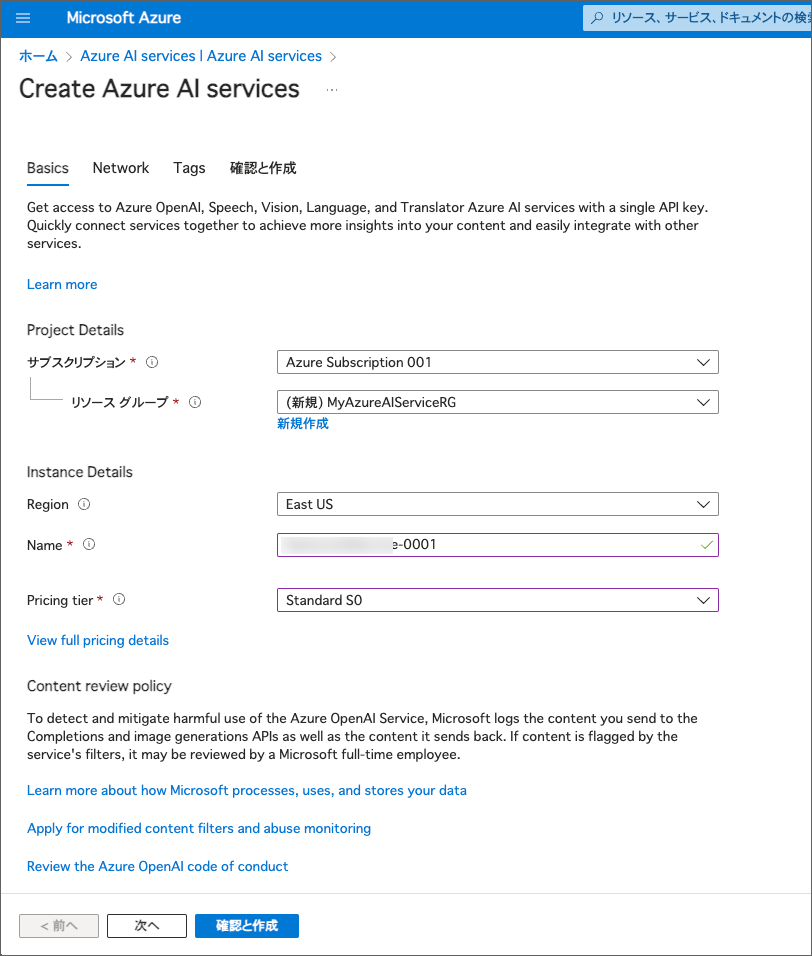
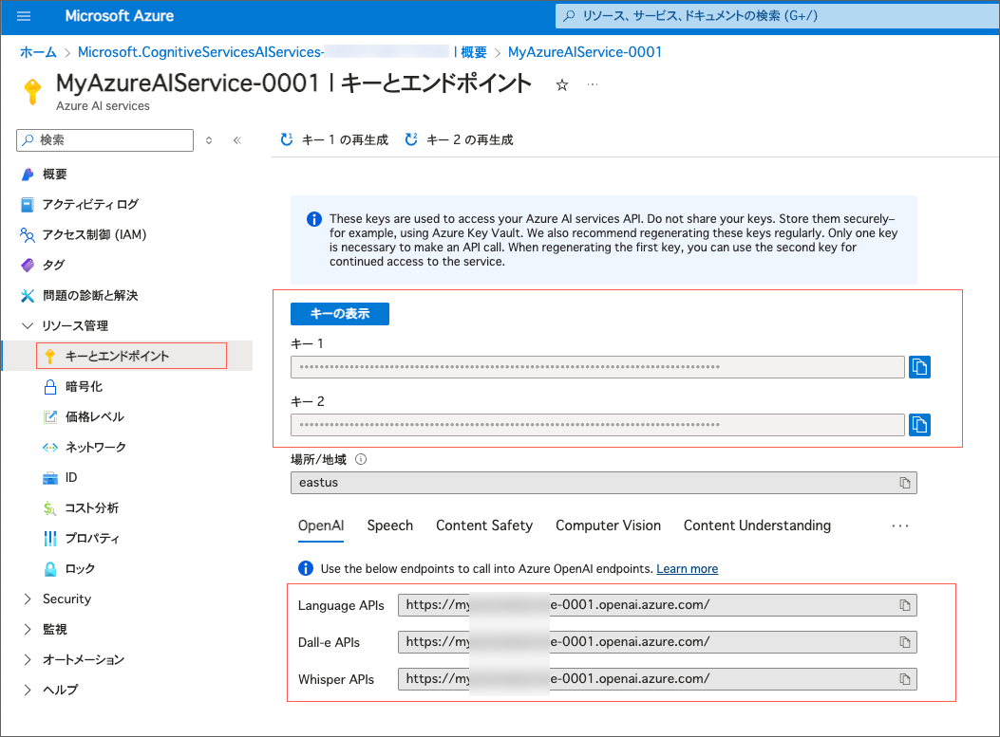

---
lab:
    title: 'Azure AI Service のセキュリティを管理する'
    module: 'Module 2 - Azure AI サービスの使用を開始する'
---

# Azure AI サービスのセキュリティを管理する

セキュリティはどんなアプリケーションでも重要なポイントです。開発者として、Azure AI Service のようなリソースへのアクセスは必要な人だけに制限するようにしましょう。

Azure AI サービスへのアクセスは、通常、Azure AI Service のリソースを作成したときに生成される認証キーを使って制御されます。

## Visual Studio Code にリポジトリをクローンする

コードを開発するには、Visual Studio Code を使います。アプリのコードファイルは GitHub リポジトリに用意されています。

> **ヒント**: 既に **mslearn-ai-services** リポジトリをクローンしている場合は、それを Visual Studio Code で開いてください。そうでない場合は、以下の手順に従って開発環境にクローンしてください。

1. Visual Studio Code を起動します。
2. コマンドパレットを開きます（SHIFT+CTRL+P）し、**Git: Clone** コマンドを実行して `https://github.com/mocaomochi/mslearn-ai-services.ja-jp` リポジトリをローカルフォルダにクローンします（フォルダはどこでも構いません）。
3. リポジトリがクローンされたら、そのフォルダを Visual Studio Code で開きます。
4. 必要に応じて、リポジトリ内の C# コードプロジェクトをサポートするための追加ファイルがインストールされるのを待ちます。
    > **注意**: ビルドとデバッグに必要なアセットを追加するように求められた場合は、**今は追加しない** を選択してください。

5. `Labfiles/02-ai-services-security` フォルダを展開します。

使いたい言語のフォルダを展開してください。C# と Python のコードが提供されています。

## Azure AI Services リソースを作成する

もしまだサブスクリプションに Azure AI Services のリソースが作られていない場合は、**Azure AI Services** リソースを新規で作成する必要があります。

1. `https://portal.azure.com` で Azure ポータルを開き、Azure サブスクリプションに関連付けられた Microsoft アカウントでサインインします。
2. 上部の検索バーで *Azure AI services* と入力して検索し、**Azure AI Services** を選択して、以下の設定で Azure AI Service マルチサービスアカウントリソースを作成します。

    

    > 注意: Azure には、Azure AI Serives という名前のリソースが複数種類あります。 Azure AI Services Multi Service Account は以下のスクリーンショットのアイコンのAzure AI Servicesを選択してください。

    

    - **サブスクリプション**: *自分の Azure サブスクリプション*
    - **リソースグループ**: *既存のリソースグループを選択するか新しいものを作成（制限付きのサブスクリプションを使用している場合、新しいリソースグループを作成する権限がない場合があります。その場合は提供されたものを使用してください）*
    - **Region**: *利用可能なリージョンを選択*
    - **Name**: *一意の名前を入力*
    - **Pricing tier**: Standard S0
3. 必要なチェックボックスを選択してリソースを作成します。
4. デプロイが完了するのを待ち、デプロイの詳細を確認します。

## 認証キーの管理

Azure AI Service のリソースを作成すると、2つの認証キーが生成されます。これらのキーは、Azure ポータルや Azure コマンドラインインターフェイス (CLI) を使って管理できます。

1. 認証キーとエンドポイントを取得する方法を1つ選びます:

    **Azure ポータルを使用する**
    Azure ポータルで、Azure AI サービスのリソースに移動し、**キーとエンドポイント**ページを表示します。このページには、リソースに接続してアプリケーションから使用するために必要な以下の情報が含まれています。
    
    
    - クライアントアプリケーションがリクエストを送信できる HTTP *エンドポイント*。
    - 認証に使用できる2つの*キー*（クライアントアプリケーションはどちらのキーも使用できます。一般的な方法として、1つを開発用に、もう1つを本番用に使用します。開発者が作業を終えた後、開発用のキーを再生成してアクセスを防ぐことが簡単にできます）。
    - リソースがホストされている*場所*。これは一部のAPIリクエストに必要です（すべてのAPIではありません）。

    **コマンドラインを使う**
    代わりに、以下のコマンドを使ってAzure AIサービスのキーのリストを取得することもできます。Visual Studio Codeで新しいターミナルを開きます。その後、以下のコマンドを貼り付けます。*&lt;resourceName&gt;* をAzure AIサービスリソースの名前に、*&lt;resourceGroup&gt;* をリソースグループの名前に置き換えてください。
    ```
    az cognitiveservices account keys list --name <resourceName> --resource-group <resourceGroup>
    ```

    実行結果例:
    

    コマンドを実行すると、Azure AI サービスリソースのキーのリストが表示されます。キーは **key1** と **key2** の2つがあります。

    > **ヒント**: まだ Azure CLI にサインインしていない場合は、最初に `az login` を実行してアカウントにサインインしてください。

2. Azure AI サービスをテストするには、HTTPリクエスト用のコマンドラインツールである **curl** を使うことができます。**02-ai-services-security** フォルダ内の **rest-test.cmd** を開き、以下の **curl** コマンドを編集して、*&lt;yourEndpoint&gt;* と *&lt;yourKey&gt;* をあなたのエンドポイントURIと **Key1** キーに置き換えて、Azure AI サービスリソースのテキスト解析APIを使用します。
    ```bash
    curl -X POST "<yourEndpoint>/language/:analyze-text?api-version=2023-04-01" -H "Content-Type: application/json" -H "Ocp-Apim-Subscription-Key: <your-key>" --data-ascii "{'analysisInput':{'documents':[{'id':1,'text':'hello'}]}, 'kind': 'LanguageDetection'}"
    ```

3. 変更を保存します。ターミナルで "02-ai-services-security" フォルダに移動します。（**注意**: エクスプローラーで "02-ai-services-security" フォルダを右クリックし、*統合ターミナルで開く* を選択することでこれを行うことができます）。次に、以下のコマンドを実行します。
    ```
    ./rest-test.cmd
    ```
    コマンドは、入力データの言語に関する情報を含むJSONドキュメントを返します（この場合、入力文字列がEnglishと識別されるはずです）。

    実行結果
    

4. もしキーが漏洩したり、開発者がもうアクセスする必要がなくなった場合は、ポータルやAzure CLIを使ってキーを再生成できます。以下のコマンドを実行して、**key1** キーを再生成してください（*&lt;resourceName&gt;* と *&lt;resourceGroup&gt;* を自分のリソース名とリソースグループに置き換えてください）。

    ```
    az cognitiveservices account keys regenerate --name <resourceName> --resource-group <resourceGroup> --key-name key1
    ```
    Azure AI サービスリソースのキーのリストが表示されます。**key1** が前回取得したときから変更されていることを確認してください。

5. 古いキーを使って **rest-test** コマンドを再実行します（キーボードの **^** 矢印を使って以前のコマンドを表示できます）。これだと失敗することを確認してください。
6. **rest-test.cmd** の中の *curl* コマンドを編集し、新しい **key1** の値に置き換えて変更を保存します。その後、**rest-test** コマンドを再実行すると、成功することを確認してください。

> **ヒント**: この演習では、Azure CLI パラメーターのフルネーム（**--resource-group** など）を使用しました。コマンドを短くするために、**-g** のような短い代替も使用できます（ただし、少しわかりにくくなります）。Azure AI サービス CLI コマンドのパラメーターオプションについては、[Azure AI Services CLI コマンドリファレンス](https://docs.microsoft.com/cli/azure/cognitiveservices?view=azure-cli-latest)を参照してください。

## Azure Key Vault を使った安全なキーへのアクセス
Azure AI サービスを使うアプリケーションを開発する際、認証のためにキーを使う必要があります。しかしこの場合、開発したアプリケーションのコードからキーを取得できる必要があります。キーを環境変数や設定ファイルに保存する方法もありますが、これらの方法ではキーが不正アクセスにさらされる危険性があります。Azure でアプリケーションを開発する際には、キーを安全に Azure Key Vault に保存し、*マネージドID*（つまり、アプリケーション自体が使うユーザーアカウント）を通じてキーにアクセスする方法がより良いアプローチです。

### Key Vault を作成しシークレットを追加する

まず、キーコンテナー（キーを預けておくための入れ物）を作成し、Azure AI Service キーの*シークレット*を追加します。

1. Azure AI Serviceリソースの **key1** の値をメモするか、クリップボードにコピーしてください。
2. Azure ポータルの **ホーム** ページで、**&#65291;リソースの作成** ボタンを選び、*Key Vault* を検索します。


以下の設定で **Key Vault** リソースを作成します。

   - **基本** タブ
     - **サブスクリプション**: *あなたの Azure サブスクリプション*
     - **リソースグループ**: *Azure AI サービスリソースと同じリソースグループ*
     - **Key Vault名**: *一意の名前を入力*
     - **地域**: *Azure AI サービスリソースと同じリージョン*
     - **価格レベル**:標準
     - 
   - **アクセス構成** タブ
     - **アクセス許可モデル**: コンテナのアクセスポリシー
     - **アクセス ポリシー**セクションが表示されたら、左側のチェックボックスを使って自分のユーザーを選択します。

         

    その後、**確認および作成** を選び、**作成** を選んでリソースを作成します。

1. デプロイが完了するのを待ち、キーコンテナーリソースに移動します。
2. 左側のナビゲーションペインで、**シークレット**（オブジェクトセクション内）を選択します。

   

3. **+ 生成/インポート** を選択し、次の設定で新しいシークレットを追加します。
    - **アップロードオプション**: 手動
    - **名前**: AI-Services-Key *(後でこの名前を使ってシークレットを取得するコードを実行するため、正確に一致させることが重要です)*
    - **シークレット値**: *あなたの **key1** Azure AI サービスキー*
4. **作成** を選択します。

    

### サービスプリンシパルを作成する

キーコンテナー内のシークレットにアクセスするには、シークレットにアクセスできるサービスプリンシパルをアプリケーションで使用する必要があります。Azure コマンドラインインターフェイス (CLI) を使ってサービスプリンシパルを作成し、そのオブジェクトIDを見つけ、Azure Vault 内のシークレットにアクセスする権限を付与します。

1. 次のAzure CLIコマンドを実行します。*&lt;spName&gt;* にはアプリケーションIDのための一意の適切な名前を入れます（例えば、*ai-app* の後に自分のイニシャルを付けます。この名前はテナント内で一意である必要があります）。また、*&lt;subscriptionId&gt;* と *&lt;resourceGroup&gt;* には、サブスクリプションIDとAzure AIサービスおよびキーコンテナーリソースを含むリソースグループの正しい値を入れます。

    > **ヒント**: サブスクリプションIDがわからない場合は、**az account show** コマンドを使ってサブスクリプション情報を取得します。サブスクリプションIDは出力の **id** 属性です。オブジェクトが既に存在するというエラーが表示された場合は、別の一意の名前を選んでください。
    ```
    az ad sp create-for-rbac -n "api://<spName>" --role owner --scopes subscriptions/<subscriptionId>/resourceGroups/<resourceGroup>
    ```
    このコマンドの出力には、新しいサービスプリンシパルに関する情報が含まれています。出力は次のようになります。

    ```
    {
        "appId": "abcd12345efghi67890jklmn",
        "displayName": "api://ai-app-",
        "password": "1a2b3c4d5e6f7g8h9i0j",
        "tenant": "1234abcd5678fghi90jklm"
    }
    ```

**appId**、**password**、**tenant** の値をメモしておいてください。後で必要になります（このターミナルを閉じるとパスワードを再取得できなくなるので、今のうちにメモしておくことが重要です。必要な値を見つけられるように、出力を新しいテキストファイルに貼り付けておくと良いでしょう）。

2. サービスプリンシパルの **オブジェクトID** を取得するには、次のAzure CLIコマンドを実行します。*&lt;appId&gt;* にはサービスプリンシパルのアプリIDの値を入れてください。
    ```
    az ad sp show --id <appId>
    ```

3. 返されたJSONの中の `id` の値をコピーします。
4. 新しいサービスプリンシパルがKey Vaultのシークレットにアクセスできるようにするために、次のAzure CLIコマンドを実行します。*&lt;keyVaultName&gt;* にはAzure Key Vaultリソースの名前を、*&lt;objectId&gt;* にはコピーしたサービスプリンシパルのIDの値を入れてください。
    ```
    az keyvault set-policy -n <keyVaultName> --object-id <objectId> --secret-permissions get list
    ```
### アプリケーションでサービスプリンシパルを使用する

これで、アプリケーションでサービスプリンシパルのIDを使用して、キーコンテナ内の秘密のAzure AI Serviceキーにアクセスし、それを使ってAzure AI Serviceリソースに接続できるようになりました。

> **注意**: この演習では、サービスプリンシパルの認証情報をアプリケーションの設定に保存し、それを使ってアプリケーションコード内で **ClientSecretCredential** アイデンティティを認証します。これは開発やテストには問題ありませんが、実際の本番アプリケーションでは、管理者がアプリケーションに*マネージドID*を割り当て、パスワードをキャッシュしたり保存したりせずにサービスプリンシパルのアイデンティティを使ってリソースにアクセスするようにします。

1. ターミナルで、使いたい言語のフォルダに移動します。**C-Sharp** フォルダを使う場合は `cd C-Sharp` コマンドを、**Python** フォルダを使う場合は `cd Python` コマンドを実行します。その後、`cd keyvault_client` コマンドを実行してアプリのフォルダに移動します。
2. Azure Key Vault と Azure AI Service のテキスト分析APIを使うために必要なパッケージをインストールします。使いたい言語に応じて、以下のコマンドを実行してください。

    **C#**

    ```
    dotnet add package Azure.AI.TextAnalytics --version 5.3.0
    dotnet add package Azure.Identity --version 1.12.0
    dotnet add package Azure.Security.KeyVault.Secrets --version 4.6.0
    ```

    **Python**

    ```
    pip install azure-ai-textanalytics==5.3.0
    pip install azure-identity==1.17.1
    pip install azure-keyvault-secrets==4.8.0
    ```
    **C#**

    ```
    dotnet add package Azure.AI.TextAnalytics --version 5.3.0
    dotnet add package Azure.Identity --version 1.12.0
    dotnet add package Azure.Security.KeyVault.Secrets --version 4.6.0
    ```

    **Python**

    ```
    pip install azure-ai-textanalytics==5.3.0
    pip install azure-identity==1.17.1
    pip install azure-keyvault-secrets==4.8.0
    ```

3. **keyvault-client** フォルダの内容を確認し、設定ファイルが含まれていることを確認します。
    - **C#**: appsettings.json
    - **Python**: .env

    設定ファイルを開き、以下の設定に従って値を更新します。
    
    - あなたの Azure AI Services リソースの **エンドポイント**
    - あなたの **Azure Key Vault** リソースの名前
    - サービスプリンシパルの **テナント**
    - サービスプリンシパルの **appId**
    - サービスプリンシパルの **パスワード**

    **CTRL+S** を押して変更を保存します。

4. **keyvault-client** フォルダにはクライアントアプリケーションのコードファイルが含まれています。

    - **C#**: Program.cs
    - **Python**: keyvault-client.py

    コードファイルを開いて内容を確認し、次の点に注意してください:
    - インストールしたSDKの名前空間がインポートされていること
    - **Main** 関数の中でアプリケーションの設定を取得し、その後サービスプリンシパルの認証情報を使ってキーコンテナーからAzure AIサービスのキーを取得するコードがあること
    - **GetLanguage** 関数がSDKを使ってサービスのクライアントを作成し、そのクライアントを使って入力されたテキストの言語を検出すること

5. 次のコマンドを入力してプログラムを実行します:

    **C#**
    ```
    dotnet run
    ```

    **Python**
    ```
    python keyvault-client.py
    ```

6. プロンプトが表示されたら、いくつかのテキストを入力して、サービスが検出する言語を確認します。例えば、「Hello」、「Bonjour」、「Gracias」を入力してみてください。
7. アプリケーションのテストが終わったら、「quit」と入力してプログラムを終了します。

## リソースのクリーンアップ

このラボで作成した Azure リソースを他のトレーニングモジュールで使用しない場合は、追加の料金が発生しないように削除することができます。

1. `https://portal.azure.com` で Azure ポータルを開き、上部の検索バーでこのラボで作成したリソースを検索します。

2. リソースのページで **削除** を選択し、指示に従ってリソースを削除します。または、リソースグループ全体を削除して、すべてのリソースを一度にクリーンアップすることもできます。

## 詳細情報

Azure AI サービスのセキュリティについての詳細は、[Azure AI Services セキュリティドキュメント](https://docs.microsoft.com/azure/ai-services/security-features)を参照してください。
