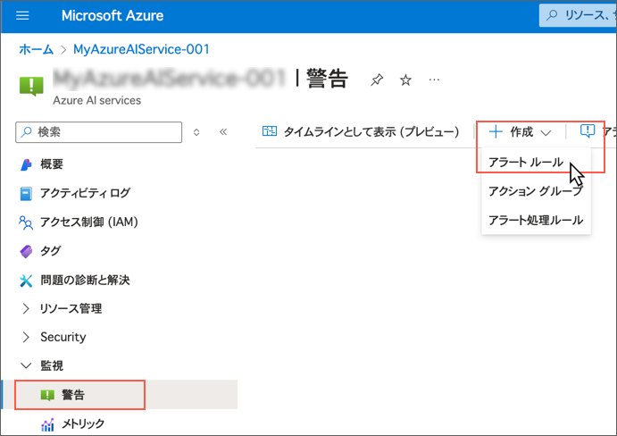
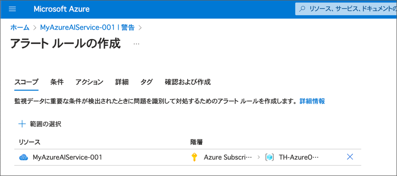
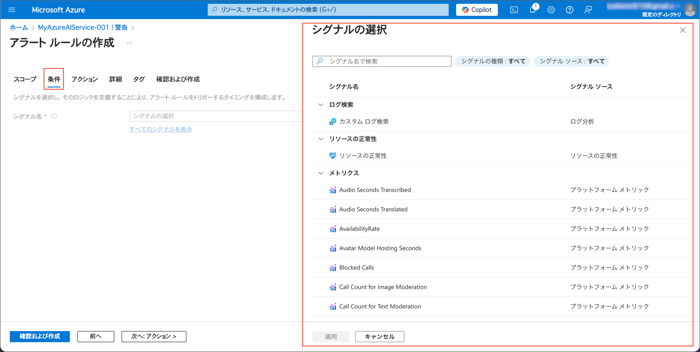
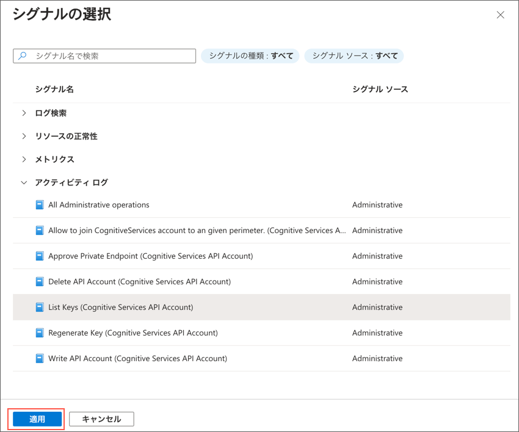
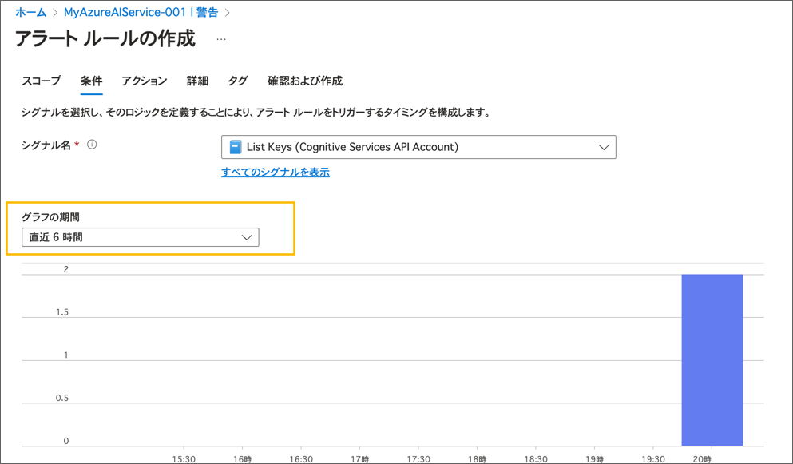
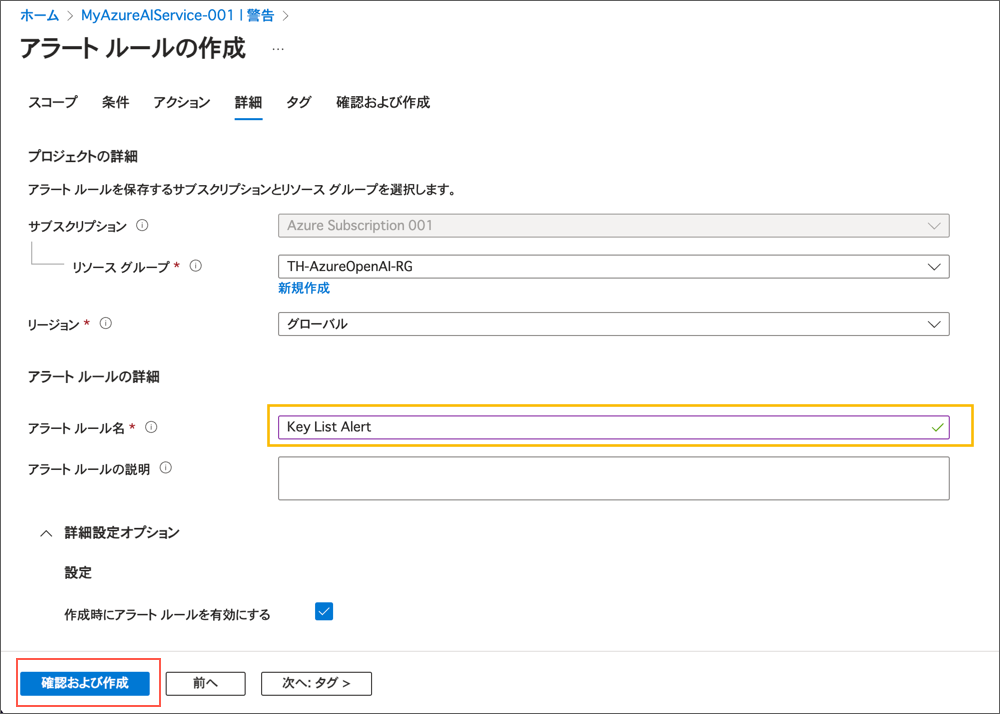
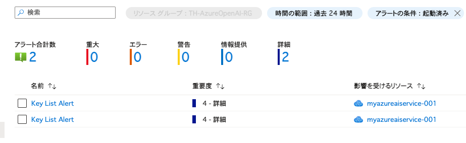
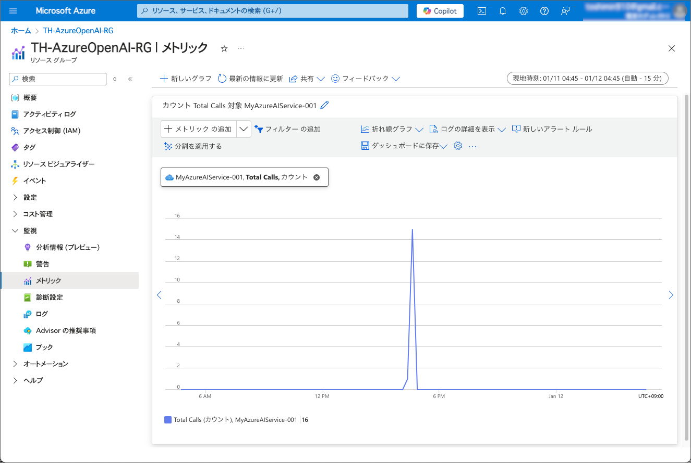

---
lab:
    title: 'Azure AI サービスを監視する'
    module: 'Module 2 - Azure AI サービスの使用を開始する'
---

# Azure AI サービスを監視する

Azure AI サービスは、アプリケーション全体のインフラストラクチャの重要な部分となることがあります。アクティビティを監視し、注意が必要な問題についてアラートを受け取ることが重要です。

## Visual Studio Code にリポジトリをクローンする

コードを開発するには、Visual Studio Code を使います。アプリのコードファイルは GitHub リポジトリに用意されています。

> **ヒント**: 既に **mslearn-ai-services** リポジトリをクローンしている場合は、それを Visual Studio Code で開いてください。そうでない場合は、以下の手順に従って開発環境にクローンしてください。

1. Visual Studio Code を起動します。
2. コマンドパレットを開きます（SHIFT+CTRL+P）し、**Git: Clone** コマンドを実行して `https://github.com/mocaomochi/mslearn-ai-services.ja-jp` リポジトリをローカルフォルダにクローンします（フォルダはどこでも構いません）。
3. リポジトリがクローンされたら、そのフォルダを Visual Studio Code で開きます。
4. 必要に応じて、リポジトリ内の C# コードプロジェクトをサポートするための追加ファイルがインストールされるのを待ちます。
    > **注意**: ビルドとデバッグに必要なアセットを追加するように求められた場合は、**今は追加しない** を選択してください。
5. `Labfiles/03-monitor-ai-services` フォルダを展開します。

## Azure AI Services リソースを作成する

もしまだサブスクリプションに Azure AI Services のリソースが作られていない場合は、**Azure AI Services** リソースを新規で作成する必要があります。

1. `https://portal.azure.com` で Azure ポータルを開き、Azure サブスクリプションに関連付けられた Microsoft アカウントでサインインします。
2. 上部の検索バーで *Azure AI services* と入力して検索し、**Azure AI Services** を選択して、以下の設定で Azure AI Service マルチサービスアカウントリソースを作成します。

    

    > 注意: Azure には、Azure AI Serives という名前のリソースが複数種類あります。 Azure AI Services Multi Service Account は以下のスクリーンショットのアイコンのAzure AI Servicesを選択してください。

    

    - **サブスクリプション**: *自分の Azure サブスクリプション*
    - **リソースグループ**: *既存のリソースグループを選択するか新しいものを作成（制限付きのサブスクリプションを使用している場合、新しいリソースグループを作成する権限がない場合があります。その場合は提供されたものを使用してください）*
    - **Region**: *利用可能なリージョンを選択*
    - **Name**: *一意の名前を入力*
    - **Pricing tier**: Standard S0
3. 必要なチェックボックスを選択してリソースを作成します。
4. デプロイが完了するのを待ち、デプロイの詳細を確認します。
5. リソースがデプロイされたら、そのリソースに移動し、**キーとエンドポイント** ページを表示します。エンドポイント URI をメモしておいてください。後で必要になります。

## アラートを作成する
Azure AI サービスのリソースでのアクティビティを検出するために、アラートルールを定義して監視を開始しましょう。

1. Azure ポータルで、Azure AI サービスのリソースに移動し、**警告** ページ（**監視** セクション内）を表示します。
2. **+ 作成** ドロップダウンを選択し、**アラートルール** を選択します。
   
3. **アラートルールの作成** ページで、**スコープ** の下に Azure AI サービスのリソースがリストされていることを確認します。（**範囲の選択** ペインが開いている場合は閉じてください）
   
4. **条件** タブを選択し、**すべてのシグナルを表示** リンクを選択して、右側に表示される **シグナルの選択** ペインを表示します。ここで監視するシグナルタイプを選択します。
   
5. **シグナルタイプ** リストで、**アクティビティログ** セクションまでスクロールし、**List Keys（Cognitive Services API Account）** を選択します。その後、**適用** を選択します。
   
6. 過去6時間のアクティビティを確認します。
   
7. **アクション** タブを選択します。ここでは、*アクショングループ* を指定できます。これは、アラートが発生したときに自動化されたアクションを設定する機能です。例えば、メール通知を送信することができます。この演習では行いませんが、本番環境では便利です。
8. **詳細** タブで、**アラートルール名** を **Key List Alert** に設定します。
   
9.  **確認および作成** を選択します。
10. アラートの設定を確認し、**作成** を選択してアラートルールが作成されるのを待ちます。
11. 次のコマンドを使用して、Azure AI サービスのキーのリストを取得します。*&lt;resourceName&gt;* を Azure AI サービスのリソース名に、*&lt;resourceGroup&gt;* をリソースグループ名に置き換えてください。

    ```
    az cognitiveservices account keys list --name <resourceName> --resource-group <resourceGroup>
    ```

    このコマンドは、Azure AI サービスリソースのキーのリストを返します。

    > **注意**: Azure CLI にログインしていない場合は、キーリストコマンドを実行する前に `az login` を実行する必要があります。

12. Azure ポータルのブラウザに戻り、**警告ページ** を更新します。テーブルに **重要度 4** の警告が表示されるはずです（表示されない場合は、5分ほど待ってから再度更新してください）。

    

13. アラートを選択して詳細を確認します。

## メトリックを視覚化する

Azure AI サービスのリソースの使用状況を監視するために、メトリックを表示できます。

1. Azure ポータルで、Azure AI サービス、リソースのページに移動し、**メトリック**（**監視** セクション内）を選択します。
2. 既存のグラフがない場合は、**+ 新しいグラフ** を選択します。次に、**メトリック** リストで表示できるメトリックを確認し、**Total Calls** を選択します。
3. **集計** リストで **カウント** を選択します。これにより、Azure AI サービス リソースへの総呼び出し数を監視できます。これは、サービスが一定期間にどれだけ使用されているかを判断するのに役立ちます。
   

4. Azure AI サービスにリクエストを生成するために、HTTP リクエスト用のコマンドライン ツールである **curl** を使用します。エディターで **rest-test.cmd** を開き、以下の **curl** コマンドを編集して、エンドポイント URI と **Key1** キーを使用して Azure AI サービス リソースのテキスト分析 API を使用します。

    ```
    curl -X POST "<your-endpoint>/language/:analyze-text?api-version=2023-04-01" -H "Content-Type: application/json" -H "Ocp-Apim-Subscription-Key: <your-key>" --data-ascii "{'analysisInput':{'documents':[{'id':1,'text':'hello'}]}, 'kind': 'LanguageDetection'}"
    ```

5. 変更を保存し、次のコマンドを実行します。

    ```
    ./rest-test.cmd
    ```

    このコマンドは、入力データの言語に関する情報を含む JSON ドキュメントを返します（英語であるはずです）。

6. **rest-test** コマンドを複数回再実行して、呼び出しアクティビティを生成します（**^** キーを使用して以前のコマンドを繰り返すことができます）。
7. Azure ポータルの **メトリック** ページに戻り、**Total Calls** カウントのグラフを更新します。*curl* を使用して行った呼び出しがグラフに反映されるまで数分かかる場合があります。グラフが更新されるまで、グラフを更新し続けてください。

    

## リソースのクリーンアップ

このラボで作成した Azure リソースを他のトレーニングモジュールで使用しない場合は、追加の料金が発生しないように削除することができます。

1. `https://portal.azure.com` で Azure ポータルを開き、上部の検索バーでこのラボで作成したリソースを検索します。

2. リソースのページで **削除** を選択し、指示に従ってリソースを削除します。または、リソースグループ全体を削除して、すべてのリソースを一度にクリーンアップすることもできます。

## 詳細情報
Azure AI サービスを監視するもう一つの方法として、*診断ログ* を使用することができます。診断ログを有効にすると、Azure AI サービスのリソース使用状況に関する詳細な情報が記録され、監視やデバッグに役立ちます。診断ログの設定後、情報が生成されるまでに1時間以上かかることがあるため、この演習では取り上げていませんが、詳しくは [Azure AI Services のドキュメント](https://docs.microsoft.com/azure/ai-services/diagnostic-logging) を参照してください。
