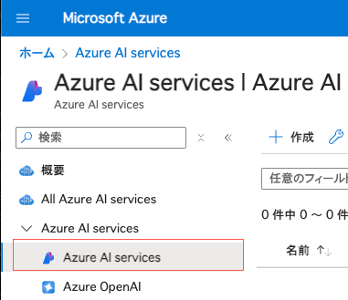

---
lab:
    title: 'Use an Azure AI Services Container'
    module: 'Module 2 - Azure AI サービスの使用を開始する'
---

# コンテナーに Azure AI サービスをデプロイする

Azure AI サービスを Azure 上でホストすることで、アプリケーション開発者は自分のコードのインフラストラクチャに集中しながら、Microsoft によって管理されるスケーラブルなサービスの恩恵を受けることができます。しかし、多くのシナリオでは、組織はサービスインフラストラクチャとサービス間でやり取りされるデータをよりコントロールする必要があります。

多くの Azure AI サービス API は *コンテナー* にパッケージ化してデプロイすることができ、組織は自分たちのインフラストラクチャで Azure AI サービスをホストできます。例えば、ローカルの Docker サーバー、Azure Container Instances、または Azure Kubernetes Services クラスターなどです。コンテナー化された Azure AI サービスは、請求をサポートするために Azure 上の Azure AI サービス アカウントと通信する必要がありますが、アプリケーションデータはバックエンドサービスに送信されません。これにより、組織はコンテナーのデプロイ構成をよりコントロールでき、認証、スケーラビリティ、その他の考慮事項に対するカスタムソリューションを実現できます。


## Visual Studio Code にリポジトリをクローンする

コードを開発するには、Visual Studio Code を使います。アプリのコードファイルは GitHub リポジトリに用意されています。

> **ヒント**: 既に **mslearn-ai-services** リポジトリをクローンしている場合は、それを Visual Studio Code で開いてください。そうでない場合は、以下の手順に従って開発環境にクローンしてください。

1. Visual Studio Code を起動します。
2. コマンドパレットを開きます（SHIFT+CTRL+P）し、**Git: Clone** コマンドを実行して `https://github.com/mocaomochi/mslearn-ai-services.ja-jp` リポジトリをローカルフォルダにクローンします（フォルダはどこでも構いません）。
3. リポジトリがクローンされたら、そのフォルダを Visual Studio Code で開きます。
4. 必要に応じて、リポジトリ内の C# コードプロジェクトをサポートするための追加ファイルがインストールされるのを待ちます。
    > **注意**: ビルドとデバッグに必要なアセットを追加するように求められた場合は、**今は追加しない** を選択してください。
5. `Labfiles/04-use-a-container` フォルダーを展開してください。

## Azure AI Services リソースを作成する

もしまだサブスクリプションに Azure AI Services のリソースが作られていない場合は、**Azure AI Services** リソースを新規で作成する必要があります。

1. `https://portal.azure.com` で Azure ポータルを開き、Azure サブスクリプションに関連付けられた Microsoft アカウントでサインインします。
2. 上部の検索バーで *Azure AI services* と入力して検索し、**Azure AI Services** を選択して、以下の設定で Azure AI Service マルチサービスアカウントリソースを作成します。

    

    > 注意: Azure には、Azure AI Serives という名前のリソースが複数種類あります。 Azure AI Services Multi Service Account は以下のスクリーンショットのアイコンのAzure AI Servicesを選択してください。

    

    - **サブスクリプション**: *自分の Azure サブスクリプション*
    - **リソースグループ**: *既存のリソースグループを選択するか新しいものを作成（制限付きのサブスクリプションを使用している場合、新しいリソースグループを作成する権限がない場合があります。その場合は提供されたものを使用してください）*
    - **Region**: *利用可能なリージョンを選択*
    - **Name**: *一意の名前を入力*
    - **Pricing tier**: Standard S0
3. 必要なチェックボックスを選択してリソースを作成します。
4. デプロイが完了するのを待ち、デプロイの詳細を確認します。
5. リソースがデプロイされたら、そのリソースに移動し、**キーとエンドポイント** ページを表示します。エンドポイント URI をメモしておいてください。後で必要になります。

## Sentiment Analysis（感情分析）コンテナーをデプロイして実行する

多くの一般的な Azure AI サービス API はコンテナーイメージとして利用できます。完全なリストについては、[Azure AI サービスのドキュメント](https://learn.microsoft.com/en-us/azure/ai-services/cognitive-services-container-support#containers-in-azure-ai-services)を参照してください。この演習では、Text Analytics の *Sentiment analysis* API のコンテナーイメージを使用しますが、他の利用可能なイメージでも同じ原則が適用されます。

1. Azure ポータルの **ホーム** ページで、**&#65291;リソースの作成** ボタンを選択し、*Container Instance* を検索して、次の設定で **コンテナー インスタンス** リソースを作成します。

    - **基本**:
        - **サブスクリプション**: *自分の Azure サブスクリプション*
        - **リソースグループ**: *Azure AI サービス リソースを含むリソース グループを選択*
        - **コンテナー名**: *一意の名前を入力*
        - **リージョン**: *利用可能なリージョンを選択*
        - **Availability Zone(可用性ゾーン)**: なし
        - **SKU**: Standard
        - **イメージのソース**: その他のレジストリ
        - **イメージタイプ**: パブリック
        - **イメージ**: `mcr.microsoft.com/azure-cognitive-services/textanalytics/sentiment:latest`
        - **OSタイプ**: Linux
        - **サイズ**: 1 vcpu、8 GB メモリ
         
    - **ネットワーキング**:
        - **ネットワーキングタイプ**: パブリック
        - **DNS名ラベル**: *コンテナー エンドポイントの一意の名前を入力*
        - **ポート**: *TCP ポートを 80 から **5000** に変更*
         
    - **詳細**:
        - **再起動ポリシー**: 失敗時
        - **環境変数**:

            | セキュアとしてマーク | キー | 値 |
            | -------------------- | --- | --- |
            | はい | `ApiKey` | *Azure AI サービス リソースのキーのいずれか* |
            | はい | `Billing` | *Azure AI サービス リソースのエンドポイント URI* |
            | いいえ | `Eula` | `accept` |

        - **コマンド オーバーライド**: [ ]
        - **キー管理**: Microsoft 管理キー (MMK)
         
    - **タグ**:
        - *タグは追加しない*

2. **確認および作成** を選択し、次に **作成** を選択します。デプロイが完了するのを待ち、デプロイされたリソースに移動します。
    > **注意**: Azure AI コンテナーを Azure コンテナーインスタンスにデプロイするには通常 5～10 分かかります。

3. コンテナー インスタンス リソースの **概要** ページで次のプロパティを確認します。
    - **状態**: *実行中* である必要があります。
    - **IP アドレス**: これはコンテナー インスタンスにアクセスするために使用できるパブリック IP アドレスです。
    - **FQDN**: これはコンテナー インスタンス リソースの *完全修飾ドメイン名* であり、IP アドレスの代わりにこれを使用してコンテナー インスタンスにアクセスできます。
    

    > **注意**: この演習では、Azure AI サービスのコンテナー イメージを Azure コンテナー インスタンス (ACI) リソースにデプロイしました。これと同様の方法で、*[Docker](https://www.docker.com/products/docker-desktop)* ホストにデプロイすることもできます。次のコマンドを実行して、ローカル Docker インスタンスに感情分析コンテナーをデプロイします。*&lt;yourEndpoint&gt;* と *&lt;yourKey&gt;* をエンドポイント URI と Azure AI サービス リソースのキーのいずれかに置き換えてください。
    > コマンドはローカル マシン上のイメージを探し、見つからない場合は *mcr.microsoft.com* イメージ レジストリからプルして Docker インスタンスにデプロイします。デプロイが完了すると、コンテナーが起動し、ポート 5000 で受信リクエストを待ち受けます。

    ```
    docker run --rm -it -p 5000:5000 --memory 8g --cpus 1 mcr.microsoft.com/azure-cognitive-services/textanalytics/sentiment:latest Eula=accept Billing=<yourEndpoint> ApiKey=<yourKey>
    ```

## コンテナーを使用する

1. エディターで **rest-test.cmd** を開き、以下の **curl** コマンドを編集して、*&lt;your_ACI_IP_address_or_FQDN&gt;* をコンテナーの IP アドレスまたは FQDN に置き換えます。

    ```
    curl -X POST "http://<your_ACI_IP_address_or_FQDN>:5000/text/analytics/v3.1/sentiment" -H "Content-Type: application/json" --data-ascii "{'documents':[{'id':1,'text':'The performance was amazing! The sound could have been clearer.'},{'id':2,'text':'The food and service were unacceptable. While the host was nice, the waiter was rude and food was cold.'}]}"
    ```

2. **CTRL+S** を押してスクリプトに変更を保存します。Azure AI サービスのエンドポイントやキーを指定する必要はありません。リクエストはコンテナー化されたサービスによって処理されます。コンテナーは定期的に Azure のサービスと通信して使用状況を報告しますが、リクエストデータは送信しません。
3. 次のコマンドを入力してスクリプトを実行します。

    ```
    ./rest-test.cmd
    ```

4. コマンドが、2つの入力ドキュメントの感情を検出した情報を含む JSON ドキュメントを返すことを確認します（順にポジティブとネガティブであるはずです）。

## クリーンアップ

コンテナー インスタンスの実験が終わったら、削除することをお勧めします。

1. Azure ポータルで、この演習のためにリソースを作成したリソースグループを開きます。
2. コンテナー インスタンス リソースを選択して削除します。

## リソースのクリーンアップ

このラボで作成した Azure リソースを他のトレーニングモジュールで使用しない場合は、追加の料金が発生しないように削除することをお勧めします。

1. `https://portal.azure.com` で Azure ポータルを開き、上部の検索バーでこのラボで作成したリソースを検索します。

2. リソースのページで **削除** を選択し、指示に従ってリソースを削除します。あるいは、リソースグループ全体を削除して、すべてのリソースを一度にクリーンアップすることもできます。

## 詳細情報

Azure AI サービスのコンテナー化について詳しくは、[Azure AI サービスのコンテナー ドキュメント](https://learn.microsoft.com/azure/ai-services/cognitive-services-container-support)を参照してください。
